# Manual de Usuario — Gestor de Pruebas para Llamados

**Generador de Evaluaciones Psicotécnicas**

Versión 1.0 — Octubre 2026 · Versión para imprimir: [Manual_de_Usuario.pdf](Manual_de_Usuario.pdf)

---

## Índice

- [1. Introducción](#1-introducción)
  - [1.1 Palabras que usa la herramienta](#11-palabras-que-usa-la-herramienta)
- [2. Pantallas de la herramienta](#2-pantallas-de-la-herramienta)
- [3. Armar una evaluación](#3-armar-una-evaluación)
  - [3.1 Paso a paso](#31-paso-a-paso)
  - [3.2 Qué contiene el formulario](#32-qué-contiene-el-formulario)
  - [3.3 Botón "Guía y corrector"](#33-botón-guía-y-corrector)
  - [3.4 Imprimir o guardar en PDF](#34-imprimir-o-guardar-en-pdf)
- [4. Asistente "Directrices desde bases (IA)"](#4-asistente-directrices-desde-bases-ia)
  - [4.1 Paso a paso](#41-paso-a-paso)
  - [4.2 Qué hacer con la respuesta de la IA](#42-qué-hacer-con-la-respuesta-de-la-ia)
- [5. Panel de Administración](#5-panel-de-administración)
  - [5.1 Crear un área](#51-crear-un-área)
  - [5.2 Crear un cargo](#52-crear-un-cargo)
  - [5.3 Crear una dinámica](#53-crear-una-dinámica)
  - [5.4 Modificar una dinámica](#54-modificar-una-dinámica)
  - [5.5 Borrar una dinámica](#55-borrar-una-dinámica)
  - [5.6 Guardar los cambios](#56-guardar-los-cambios)
- [6. Problemas frecuentes](#6-problemas-frecuentes)

---

## 1. Introducción

El *Gestor de Pruebas para Llamados* es una herramienta para armar, en pocos minutos, todo el material necesario para evaluar a los postulantes de un llamado:

- el **informe para el evaluador**, con la explicación de cada prueba, su tiempo, qué observar y las respuestas esperadas;
- la **tabla de puntaje** de cada postulante;
- las **hojas de trabajo** que se entregan a los postulantes;
- un **panel de administración** para agregar o modificar áreas, cargos y pruebas;
- un **asistente** que, a partir de las bases del llamado, prepara un pedido para que una inteligencia artificial proponga pruebas nuevas.

No requiere usuario ni contraseña: se abre en el navegador con la dirección que le indique el responsable técnico.

### 1.1 Palabras que usa la herramienta

| Término | Significado |
|---|---|
| **Área** | Sector de la organización (p. ej. Operativa, Administración, Supervisión, Finanzas). |
| **Cargo** | Puesto al que se postula (p. ej. Administrativo, Encargado, Contador). |
| **Competencia** | Capacidad que se observa y se puntúa (p. ej. "Gestión del Tiempo"). |
| **Dinámica** | Prueba o ejercicio práctico que se aplica al postulante. |
| **Guía de observación** | Qué indica un buen desempeño (*Éxito*) y qué indica dificultades (*Alerta*). |
| **Corrector** | Respuestas correctas o esperadas de la prueba. |
| **Hoja del postulante** | Consigna que se le entrega al candidato, con renglones para responder. |
| **Dictamen global** | Conclusión final: *Apto / Apto con reservas / No apto*. |

Cada cargo y cada dinámica tienen un **código** que aparece en pantalla y en las hojas impresas (por ejemplo `CAR-ADM-GEN-01` para un cargo o `DIN-ADM-GEN-03` para una dinámica). Sirve para identificar sin dudas qué prueba se aplicó; la herramienta los crea sola.

---

## 2. Pantallas de la herramienta

| Pantalla | Para qué se usa |
|---|---|
| **Generador de Evaluaciones** | Uso diario: armar e imprimir las evaluaciones. Es la pantalla que se abre al ingresar. |
| **Panel de Administración** | Agregar o modificar áreas, cargos y dinámicas. Se entra con el botón **⚙️ Administrar Datos**. |

---

## 3. Armar una evaluación

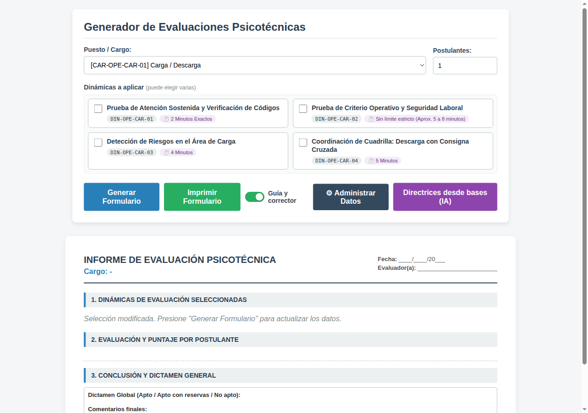

### 3.1 Paso a paso

1. En **Puesto / Cargo**, elija el cargo del llamado.
2. En **Postulantes**, indique cuántos postulantes va a evaluar (de 1 a 10). Se preparará una tabla de puntaje y un juego de hojas para cada uno.
3. En **Dinámicas a aplicar**, marque las pruebas que va a usar. Aparecen solo las del cargo elegido y puede marcar varias. Cada tarjeta muestra su código y su tiempo. Si marca más de una, arriba a la derecha verá el **tiempo total estimado**.
4. Presione **Generar Formulario**.
5. Revise el resultado que aparece debajo y presione **Imprimir Formulario**.

> **Atención:** si después de generar cambia el cargo o marca/desmarca una dinámica, el formulario de abajo se borra y aparece el aviso *"Selección modificada. Presione 'Generar Formulario' para actualizar los datos."* Es para evitar imprimir datos mezclados: vuelva a presionar **Generar Formulario**.

### 3.2 Qué contiene el formulario

Arriba se ve el título **INFORME DE EVALUACIÓN PSICOTÉCNICA**, el cargo y espacios para completar *Fecha* y *Evaluador(a)*.

**1. Dinámicas de evaluación seleccionadas.** Para cada prueba: título, código, descripción, tiempo límite, objetivo, guía de observación y corrector.

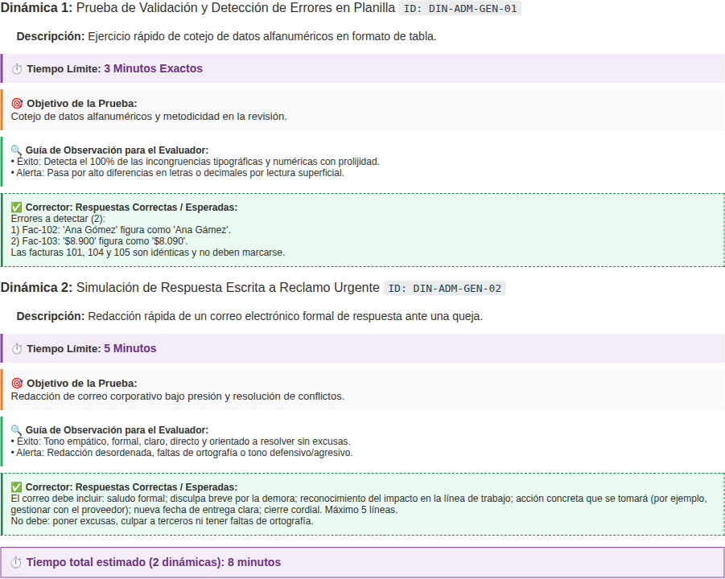

**2. Evaluación y puntaje por postulante.** Primero se listan las competencias a observar. Después, para cada postulante, hay una tabla:

- cada **fila** es una dinámica (D1, D2, …);
- cada **columna** es una competencia, que se puntúa **de 0 a 5**;
- **Total dinámica** es la suma de la fila;
- la fila **TOTAL** suma cada competencia en todas las pruebas, y en la esquina va el total general.

Debajo hay un recuadro para **observaciones y notas de conducta** del postulante.

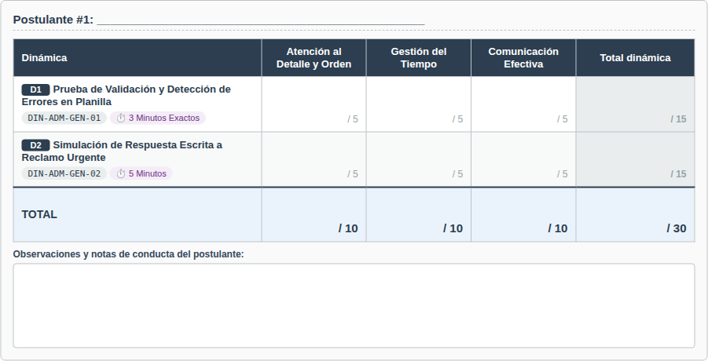

*Ejemplo:* con 3 competencias y 2 dinámicas, cada dinámica vale hasta 15 puntos, cada competencia hasta 10 y el total hasta 30.

**3. Conclusión y dictamen general.** Espacio para marcar *Apto / Apto con reservas / No apto* y escribir comentarios finales.

**Hojas de trabajo del postulante.** Al final están las hojas para entregar a los candidatos: una por cada prueba y por cada postulante. Tienen lugar para nombre y fecha, el código de la prueba, el tiempo límite, la consigna y renglones para responder.

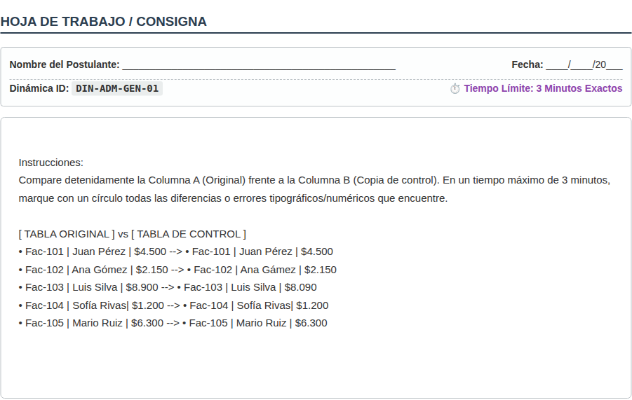

### 3.3 Botón "Guía y corrector"

El interruptor **Guía y corrector** (encendido de fábrica) muestra u oculta la guía de observación y las respuestas esperadas. Apáguelo si necesita imprimir el informe **sin las respuestas**, por ejemplo cuando el material puede quedar a la vista de otras personas.

### 3.4 Imprimir o guardar en PDF

- **Imprimir Formulario** abre la ventana de impresión. Los botones y opciones de arriba no se imprimen; solo el informe y las hojas.
- Está preparado para **hoja A4**. Cada hoja del postulante sale en una página aparte.
- Para guardar en PDF, elija *Guardar como PDF* en lugar de una impresora.
- Para conservar los colores de los recuadros, active la opción *Gráficos de fondo* en la ventana de impresión.

---

## 4. Asistente "Directrices desde bases (IA)"

El botón violeta **Directrices desde bases (IA)** ayuda a crear pruebas nuevas para un llamado a partir de sus **bases** en Word (.docx).

> **Privacidad:** el archivo se lee en su propia computadora y **no se envía a ningún lado**. Lo único que usted copiará y llevará a la inteligencia artificial es el texto final, que puede revisar antes.

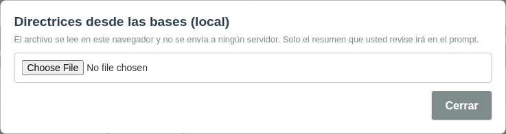

### 4.1 Paso a paso

1. Presione **Directrices desde bases (IA)** y elija el archivo **.docx** con las bases.
2. La herramienta completa sola:
   - **Cargo del llamado** y **Área**. Puede corregirlos. Debajo de cada uno aparece un aviso: en **verde** si ya existe, en **rojo** si hay que crearlo, o una sugerencia si encontró uno **parecido** (con los botones *Usar existente* o *Crear nuevo*).
   - **Competencias detectadas**: casillas ya marcadas según lo que dicen las bases. Puede marcar o desmarcar.
   - **Tareas típicas**: tomadas de las funciones del cargo. Borre o modifique lo que no quiera compartir.
3. En **Términos a enmascarar** escriba, separados por coma, los nombres que no deben salir (organismo, personas, sectores). Se reemplazarán por `[X]`.
4. Presione **Generar prompt**.
5. Lea el texto, presione **Copiar** y péguelo en la inteligencia artificial que use (ChatGPT, Copilot, Gemini, etc.).

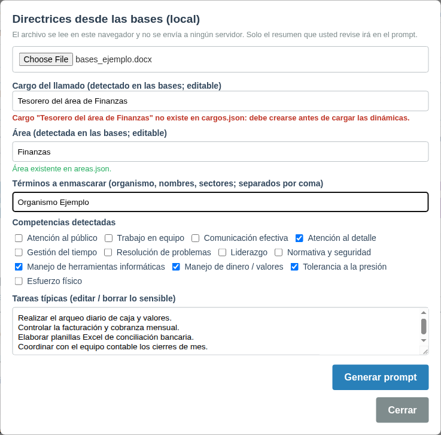

> **Consejo:** revise siempre el *Cargo*. A veces toma palabras de más (en el ejemplo puso "Tesorero del área de Finanzas" cuando lo correcto era "Tesorero").

Además de los términos que usted indique, la herramienta oculta sola los **correos electrónicos, números de documento, fechas, montos de dinero y números de llamado**.

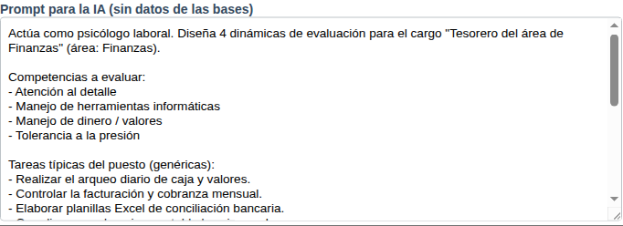

### 4.2 Qué hacer con la respuesta de la IA

La IA devolverá **4 pruebas nuevas** (y, si hacía falta, el área y el cargo) en un formato especial listo para cargar. Entregue esa respuesta al **responsable técnico** de la herramienta para que la incorpore. Revise siempre el contenido propuesto antes de usarlo en una evaluación real.

---

## 5. Panel de Administración

Se entra con **⚙️ Administrar Datos** desde la pantalla principal y se sale con **⬅️ Volver al Generador**.

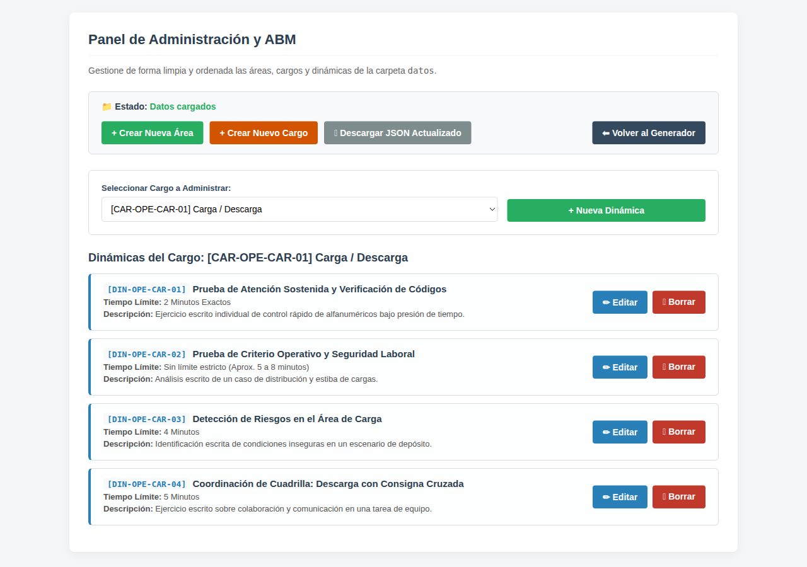

Arriba, **Estado** indica *Datos cargados* (verde) si todo está bien.

> ⚠️ **Muy importante:** lo que agregue o cambie en este panel **no queda guardado automáticamente**. Si recarga o cierra la página antes de guardar, **se pierde**. Al terminar, siga los pasos de la sección 5.6.

### 5.1 Crear un área

1. Presione **+ Crear Nueva Área**.
2. Escriba el **nombre** (p. ej. *Tecnología y Sistemas*).
3. Escriba una **sigla de 3 letras** (p. ej. *TEC*). No puede repetirse.
4. Presione **Guardar Área**.

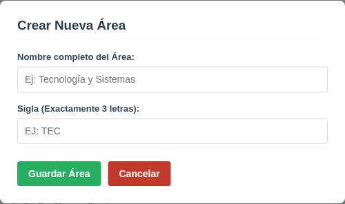

### 5.2 Crear un cargo

1. Presione **+ Crear Nuevo Cargo**.
2. Escriba el **nombre del cargo** (p. ej. *Tesorero*).
3. Elija el **área**.
4. Escriba una **sigla de especialidad** de hasta 3 letras (p. ej. *TES*).
5. El código se arma solo. Presione **Crear Cargo**.

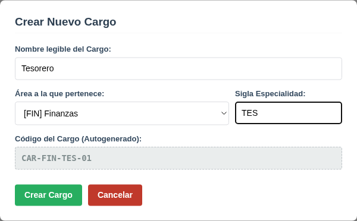

> El cargo nuevo se crea con dos competencias de ejemplo. Para definir sus competencias reales, pídaselo al responsable técnico.

### 5.3 Crear una dinámica

1. En **Seleccionar Cargo a Administrar**, elija el cargo.
2. Presione **+ Nueva Dinámica**.
3. Complete el formulario:

| Campo | Qué escribir |
|---|---|
| Cargo Objetivo | Cargo al que pertenece la prueba (ya viene elegido). |
| Código | Se completa solo. |
| Título de la Dinámica | Nombre corto de la prueba. |
| Descripción Breve | En qué consiste, en una línea. |
| Tiempo Límite | P. ej. *3 Minutos Exactos* o *Aprox. 5 a 8 minutos*. |
| Hoja de Trabajo / Consigna para el Postulante | El texto que leerá el candidato. Se respetan los saltos de línea. |
| Renglones para escribir | Cantidad de líneas en blanco para que responda (0 a 30). |
| Objetivo / Consigna para el Evaluador | Qué mide la prueba. |
| Guía de Observación | Sugerencia: una línea "• Éxito: …" y otra "• Alerta: …". |
| Corrector | La respuesta correcta o esperada (opcional). |

4. Presione **Guardar Dinámica**.

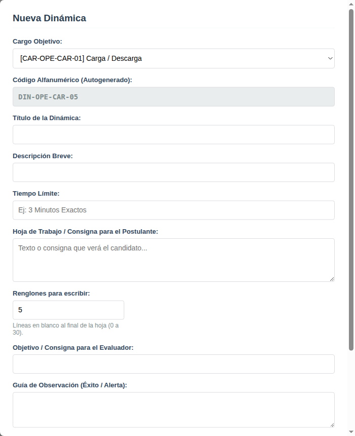

### 5.4 Modificar una dinámica

Presione **✏️ Editar** en la prueba, haga los cambios y presione **Guardar Dinámica**. El código no cambia. Si la prueba en realidad corresponde a otro cargo, es mejor crearla de nuevo en ese cargo y borrar la anterior.

### 5.5 Borrar una dinámica

Presione **🗑️ Borrar** y confirme.

### 5.6 Guardar los cambios

1. Presione **📥 Descargar JSON Actualizado**. Se descargan **tres archivos** (`areas.json`, `cargos.json` y `dinamicas.json`). Si el navegador pregunta si permite *descargar varios archivos*, acepte.
2. Envíe esos tres archivos al **responsable técnico** para que los publique. Recién entonces los cambios quedarán disponibles para todos.

> Desde el panel no se pueden modificar ni borrar áreas o cargos ya existentes; para eso, consulte al responsable técnico.

---

## 6. Problemas frecuentes

| Qué pasa | Qué hacer |
|---|---|
| Aparece "Error de conexión…" al entrar, o el Estado dice "Error al leer los datos". | Verifique que entró con la dirección correcta. Si sigue, avise al responsable técnico. |
| La lista de cargos está vacía. | Avise al responsable técnico (puede haber un error en los datos). |
| Dice "No hay dinámicas para este cargo". | Ese cargo todavía no tiene pruebas: créelas en el Panel de Administración. |
| Dice "Por favor seleccione al menos una dinámica." | Marque una o más pruebas antes de presionar Generar. |
| El formulario de abajo se borró. | Cambió el cargo o las pruebas marcadas: presione otra vez **Generar Formulario**. |
| Perdí los cambios del Panel de Administración. | Se recargó la página sin guardar. Repita los cambios y use **Descargar JSON Actualizado** antes de salir. |
| Solo se descargó un archivo. | El navegador bloqueó las descargas múltiples: permítalas y vuelva a presionar el botón. |
| El asistente dice "No se pudo cargar el lector de .docx". | Revise su conexión a Internet. El archivo debe ser `.docx` (no `.doc` ni `.pdf`). |
| La impresión sale sin colores. | Active *Gráficos de fondo* en la ventana de impresión. |
