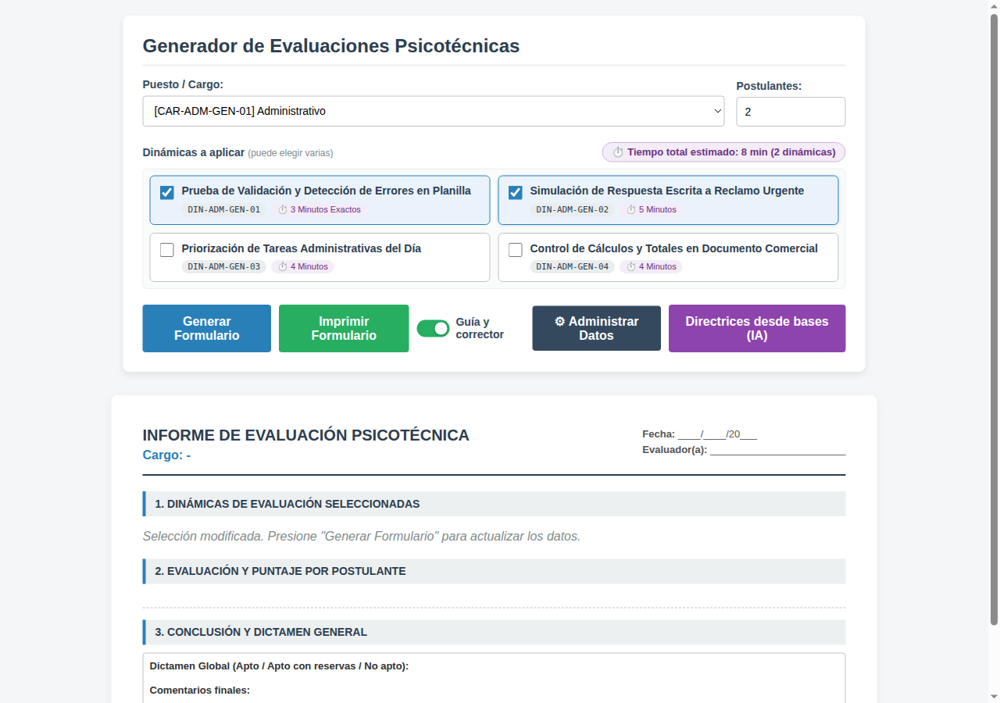

# Gestor de Pruebas para Llamados

Aplicación web para armar e imprimir **evaluaciones psicotécnicas** en procesos de selección (llamados). Se elige el cargo, la cantidad de postulantes y las dinámicas, y la app genera:

- el **informe para el evaluador**, con la descripción de cada dinámica, el tiempo total, la guía de observación y las respuestas esperadas;
- la **tabla de puntaje** por competencia (escala 0 a 5), con el dictamen de cada postulante;
- las **hojas de trabajo** de cada postulante, que al imprimir empiezan en página nueva.



## Funcionalidades

| Pantalla | Para qué sirve |
|---|---|
| **Generador** (`index.html`) | Armar la evaluación, mostrar u ocultar la guía y el corrector, e imprimir en A4. |
| **Directrices desde bases (IA)** | Leer las bases del llamado (`.docx`), anonimizar los datos sensibles y generar un *prompt* para que una IA proponga dinámicas nuevas. El archivo se procesa en el navegador y no se sube a ningún servidor. |
| **Panel de Administración** (`admin.html`) | Crear áreas y cargos, y crear, editar o borrar dinámicas. Los cambios se guardan descargando los JSON actualizados. |

Catálogo incluido: 4 áreas, 5 cargos (Carga / Descarga, Administrativo, Encargado, Jefe y Contador) y 20 dinámicas.

## Documentación

- 📘 [Manual de Usuario](docs/MANUAL_USUARIO.md) ([PDF](docs/Manual_de_Usuario.pdf)): uso de las pantallas, para evaluadores y administradores.
- 🛠️ [Manual Técnico](docs/MANUAL_TECNICO.md) ([PDF](docs/Manual_Tecnico.pdf)): funcionamiento, modelo de datos, instalación y mantenimiento.

## Ejecución local

Es una aplicación estática (HTML, CSS y JavaScript, sin dependencias ni *build*). Hay que servirla por HTTP, porque los datos se cargan con `fetch()` y abrir `index.html` con doble clic da error.

```bash
python -m http.server 8080
# o bien
npx serve .
```

Después abrir:

- Generador: <http://localhost:8080>
- Panel de Administración: <http://localhost:8080/admin.html>

## Publicación

Se puede publicar en cualquier hosting estático (Netlify, GitHub Pages, Apache, Nginx, IIS). Se sube la carpeta raíz tal cual, sin comando de *build*.

## Actualizar los datos

1. En el **Panel de Administración**, hacer los cambios.
2. Hacer clic en **Descargar JSON Actualizado**. Se descargan `areas.json`, `cargos.json` y `dinamicas.json`.
3. Reemplazar esos archivos en `datos/` y volver a publicar.

> Los cambios del panel quedan solo en memoria. Si se recarga la página antes de descargar los JSON, se pierden.

## Estructura

```
├── index.html / script.js / style.css   Generador e impresión
├── admin.html / admin.js / admin.css    Panel de Administración
├── bases_ia.js                          Asistente "Directrices desde bases (IA)"
├── utilidades.js                        Utilidades (escape de HTML)
├── datos/
│   ├── datos.js                         Carga y exportación de datos
│   ├── areas.json                       Áreas
│   ├── cargos.json                      Cargos y competencias
│   └── dinamicas.json                   Dinámicas por cargo
└── docs/                                Manuales (Markdown y PDF) y capturas
```
